# tw-quant-selector

台股 + ETF 自動選股系統 — 多因子量化評分、策略組合、投組回測、即時儀表板。

⚠️ 系統輸出結果僅供量化研究參考，**不構成任何投資建議**。

---

## 目錄

- [功能概覽](#功能概覽)
- [架構](#架構)
- [快速開始](#快速開始)
- [執行腳本](#執行腳本)
- [資料來源與擷取](#資料來源與擷取)
- [策略架構](#策略架構)
- [API 端點](#api-端點)
- [前端儀表板](#前端儀表板)
- [回測](#回測)
- [Docker](#docker)
- [測試](#測試)
- [排程與輪詢](#排程與輪詢)
- [即時同步](#即時同步)
- [即時監控](#即時監控)
- [FinMind 限流處理（進階）](#finmind-限流處理進階)
- [專案結構](#專案結構)

---

## 部分功能截圖

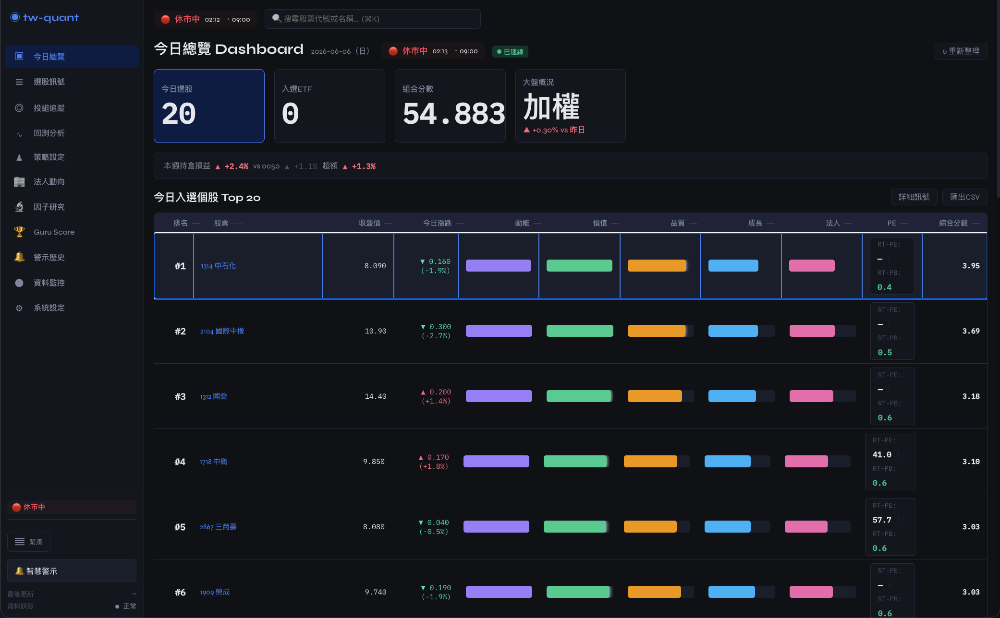
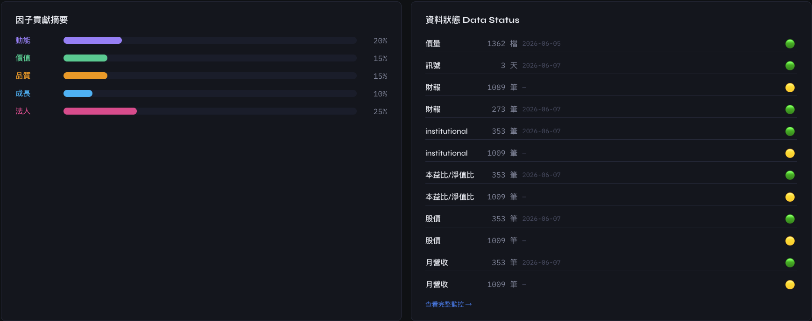
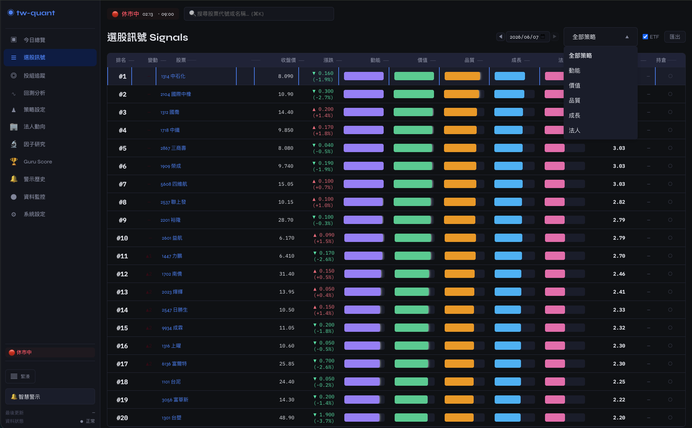
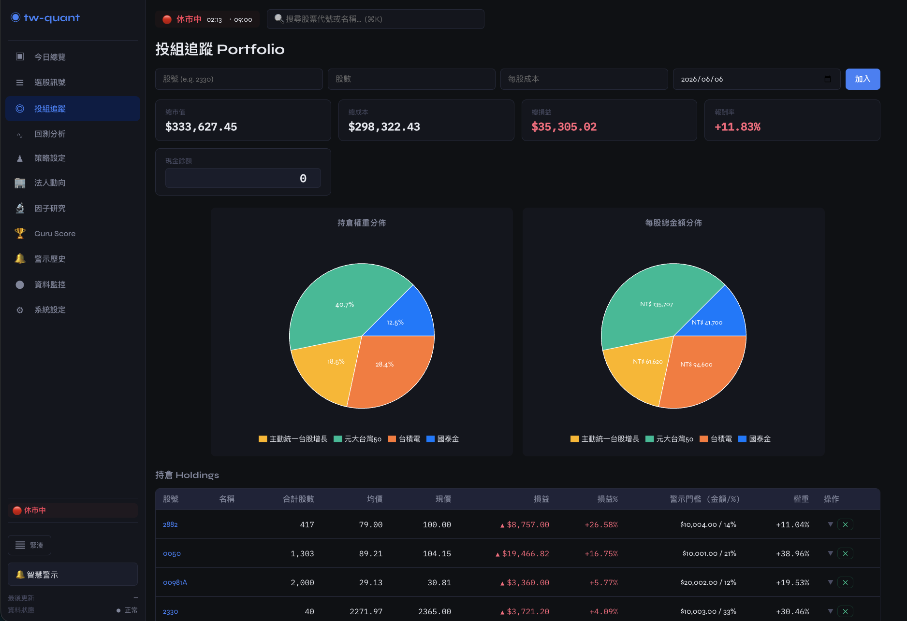
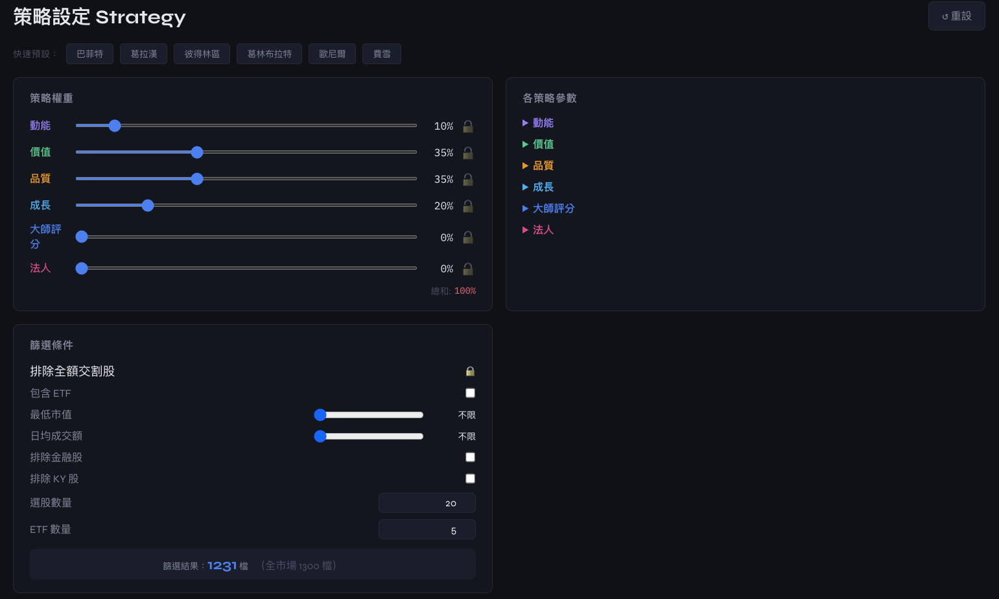
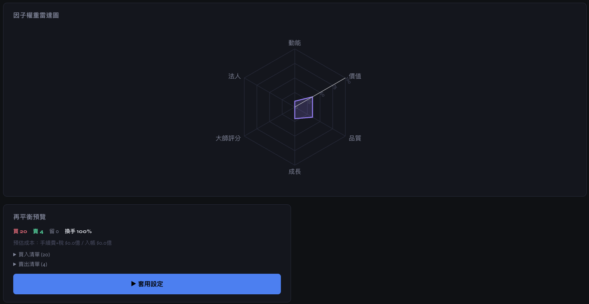
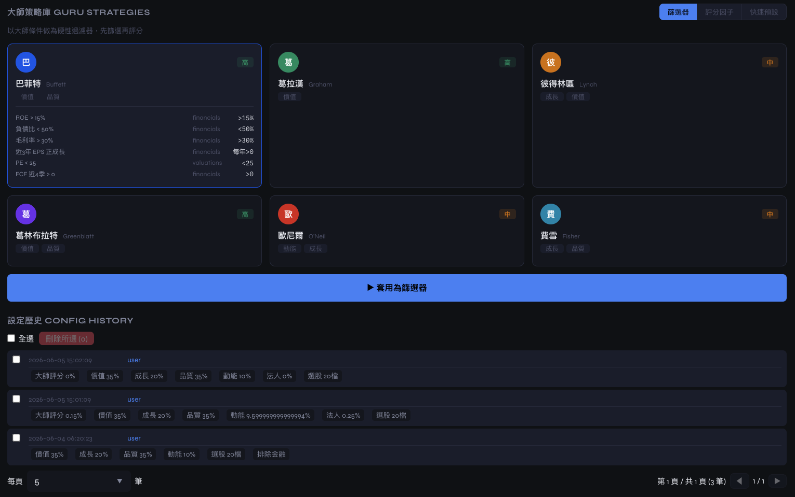
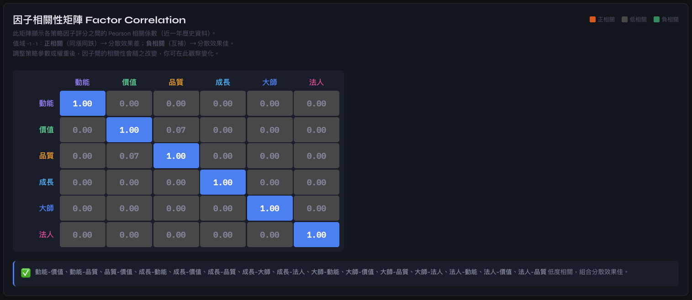
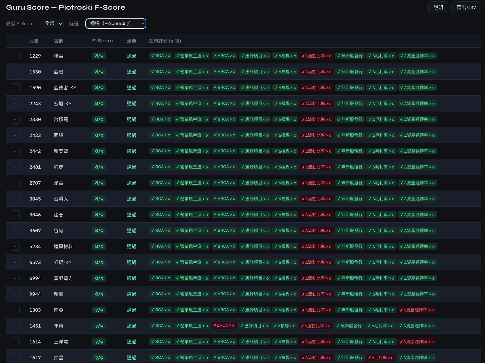
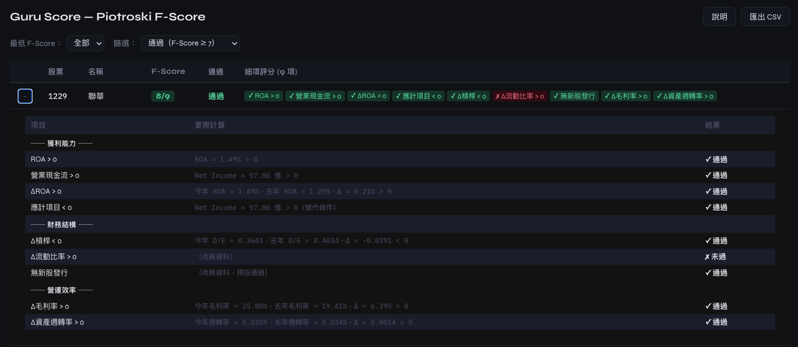
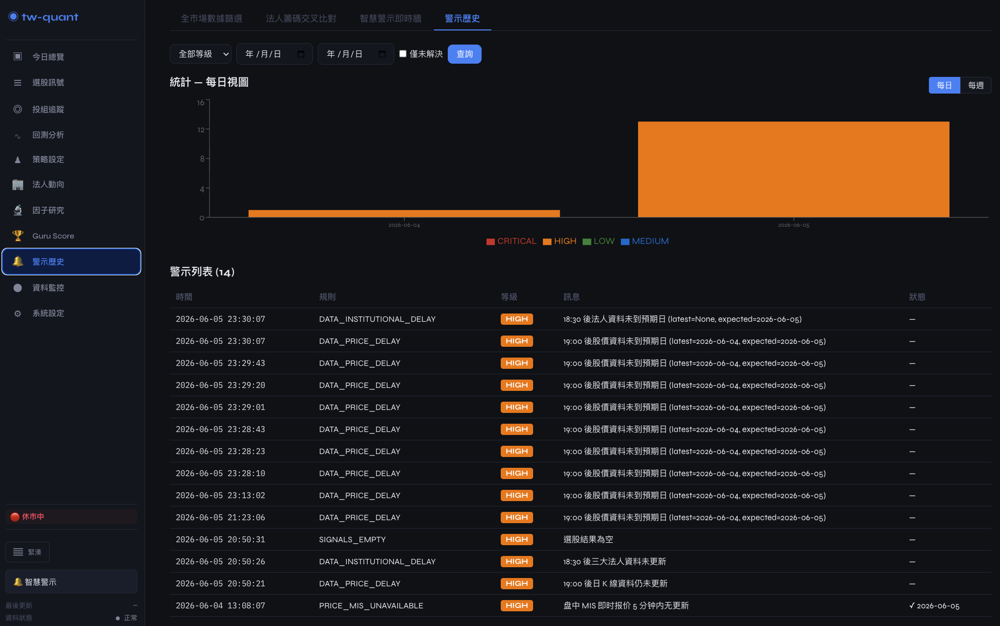
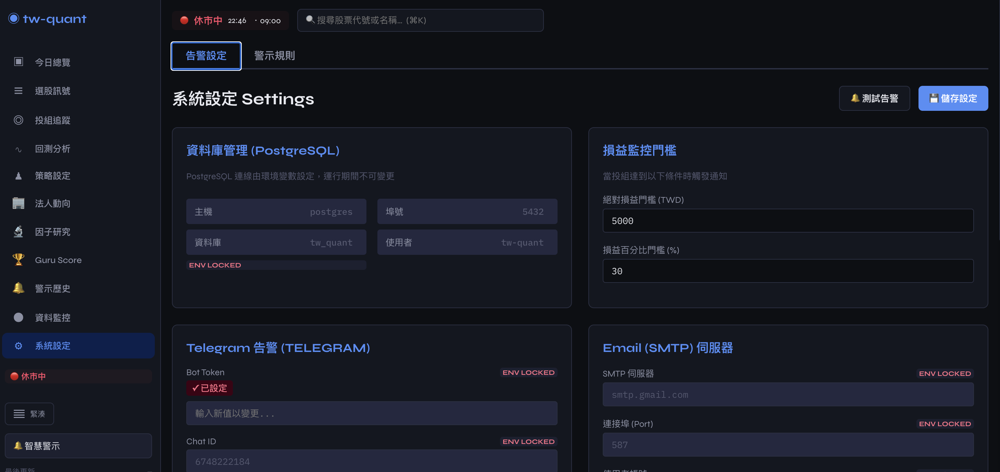
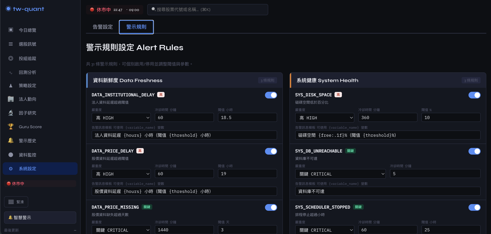
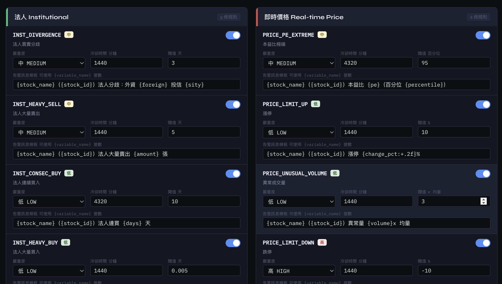
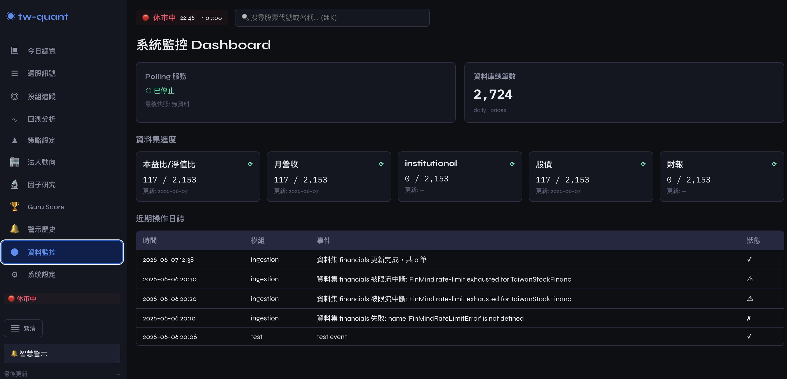

---

## 功能概覽

| 功能 | 說明 |
|------|------|
| **資料擷取** | 從 **TWSE STOCK_DAY_ALL / BWIBBU / t187ap05_L / T86**（主力、無限流）+ **FinMind**（歷史回溯）+ **TPEX** 自動抓取股價/月營收/財報/本益比/淨值比/法人買賣超 |
| **分級桶 ingestion** | 98 個分桶，分批輪詢避免超過 FinMind 免費限額（**600 req/hr**，註冊後 3000/hr） |
| **分開執行** | `--datasets price,revenue,...` 旗標可分開跑單一資料源；限流**只中斷單一 dataset**，其他照跑 |
| **Skip-already-fetched** | 每次跑前查 `MAX(date)` 與 `ingestion_tracker`，**已抓的 stock/dataset 自動跳過**，省 token |
| **持股優先模式** | 智慧預設：有 holdings 時**自動啟用**；`--no-prioritize-holdings` 可關閉。Holdings 永遠先抓，確保你持有的股票個股詳情頁 / 大師篩選**永遠有最新資料** |
| **Rate-limit 自動重試** | FinMind 402 拋例外 → 寫入 `/tmp/pipeline_state.json` → 退出 75 → wrapper 腳本 5min→1hr 退避重試 |
| **大師策略庫** | 支援巴菲特、葛拉漢、歐尼爾等 6 位大師的**篩選器**與**評分因子**實作 |
| **5 大策略因子** | 動能、價值、品質、成長 + **大師評分 (Guru Score)** |
| **綜合評分** | Z-score 標準化 + 權重組合，輸出排名選股 |
| **因子歷史趨勢** | 個股四因子（動能/價值/品質/成長）百分位數走勢 SVG 折線圖 |
| **回測引擎** | 自訂期間/權重，支援交易成本、最大回撤、Sharpe、Calmar、**互動淨值曲線**、**明細交易表** |
| **投組再平衡** | 定期再平衡（月/季），支援部分換股與閾值觸發 |
| **SSE 即時同步** | Server-Sent Events 推送投組異動，前端自動刷新 |
| **REST API** | FastAPI 提供完整 CRUD、評分/回測端點與**系統設定 API** |
| **前端儀表板** | React + TypeScript 全功能 UI，含**日曆日期選取**、**工具提示**、**列印樣式**、即時訊號、**大師預設快選** |
| **告警系統** | 支援 **Telegram Bot** 與 **Email (SMTP)** 損益監控與系統異常通知，**單筆 + 批次刪除** |
| **即時監控 (Live)** | 對接 **TWSE MIS API** 進行盤中損益監控，具備冷卻機制避免重複轟炸 |
| **靈活配置** | 支援**環境變數**設定（PostgreSQL 連線、大師 Token） |
| **匯出** | CSV / JSON 格式匯出選股訊號（支援欄位自定義） |

---

## 專案進度

**📊 開發任務進度 (86/86)**

| 狀態 | 數量 |
|------|------|
| ✅ 已完成 | 84 |
| 🚧 進行中 | 1 |
| 📋 待處理 | 1 |

---

## 架構

```
┌─────────────────────────────────────────────────────┐
│                    Frontend (React + Vite)           │
│  Dashboard │ Signals │ Stock Detail │ Backtest        │
│  Strategy │ Portfolio │ Monitor │ Settings           │
│  SSE EventSource ← 即時同步                           │
└──────────────────┬──────────────────────────────────┘
                   │ HTTP (localhost:8000 / Vite proxy)
┌──────────────────▼──────────────────────────────────┐
│              FastAPI Backend (Python)                 │
│  REST API │ EventBus(SSE) │ Strategy │ Backtest       │
│  Alert Manager │ Response: { data, meta, error }      │
└──────────────────┬──────────────────────────────────┘
                   │
┌──────────────────▼──────────────────────────────────┐
│            PostgreSQL (tw_quant)                      │
│  stocks │ daily_prices │ valuations │ portfolio       │
│  monthly_revenue │ financials │ signals │ alert_log    │
│  ingestion_tracker │ strategy_config_history          │
└──────────────────┬──────────────────────────────────┘
                   │
┌──────────────────▼──────────────────────────────────┐
│          Data Sources (擷取來源)                      │
│  TWSE (STOCK_DAY_ALL, 主要) │ FinMind (備援/TPEX)    │
│  TWSE MIS (即時) │ TWSE/TPEX (清單)                 │
│  98 buckets │ 循環機制 │ 健康檢查整合 (Alerting)       │
└─────────────────────────────────────────────────────┘
```

---

## 快速開始

### 1. 環境設定

```bash
cd ~/Projects/tw-quant-selector
cp .env.example .env   # 編輯 .env，填入 POSTGRES_* 及 FINMIND_TOKEN
```

申請 [FinMind API Token](https://finmindtrade.com/) 並寫入 `.env`：

```bash
FINMIND_TOKEN=your_token_here
```

### 2. 啟動基礎設施（PostgreSQL）

```bash
docker compose up -d postgres
```

### 3. 初始化資料庫 Schema

```bash
docker compose exec postgres psql -U tw-quant -d tw_quant -f /app/init-scripts/001-init-schema.sql
```

### 4. 啟動 API 後端

```bash
docker compose up -d app
```

Swagger UI：http://localhost:8000/docs

### 5. 啟動前端

```bash
docker compose up -d frontend
```

瀏覽器開啟 http://localhost:5173

---

## 執行腳本

所有腳本均在 Docker container 內執行，無需本地 Python 環境。

```bash
# 每日完整流程（攝取 + 評分 + 健康檢查）
docker compose exec app python3 scripts/run_daily_pipeline.py

# 只跑特定資料集（限流時建議分開跑）
docker compose exec app python3 scripts/run_daily_pipeline.py --datasets price
docker compose exec app python3 scripts/run_daily_pipeline.py --datasets revenue,financials
docker compose exec app python3 scripts/run_daily_pipeline.py --datasets institutional

# 持股優先模式（智慧預設：無 flag 時自動啟用）
docker compose exec app python3 scripts/run_daily_pipeline.py                   # 智慧預設（有 holdings 自動啟用）
docker compose exec app python3 scripts/run_daily_pipeline.py --prioritize-holdings   # 強制啟用
docker compose exec app python3 scripts/run_daily_pipeline.py --no-prioritize-holdings  # 強制關閉（純 bucket）
docker compose exec app python3 scripts/run_daily_pipeline.py --prioritize-holdings --datasets revenue

# 自動重試版（遇 FinMind rate-limit 自動 5min→1hr 退避重試，最多 10 次）
docker compose exec app bash scripts/run_pipeline_with_retry.sh

# 即時損益監控
docker compose exec app python3 scripts/check_live_alerts.py

# 排程資料攝取（單次，手動驅動；自動套用限流重試 wrapper）
docker compose run --rm scheduler

# CSV 同步至 PostgreSQL（編輯 stock_monitor.csv 後執行）
docker compose exec app python3 scripts/sync_portfolio_csv.py

# 庫存匯出至監控 JSON
docker compose exec app python3 scripts/export_portfolio.py

# 檢查攝取進度
docker compose exec app python3 scripts/check_ingestion_status.py

# 一次性歷史股價回補（初次部署或補救）
docker compose exec app python3 scripts/backfill_daily_prices.py --lookback-days 252
```

### `--datasets` 旗標說明

| 值 | 涵蓋步驟 | 來源 |
|----|---------|------|
| `price` | TWSE `STOCK_DAY_ALL` + FinMind `TaiwanStockPrice` 補抓 | TWSE + FinMind |
| `per` | TWSE `BWIBBU_ALL` + FinMind `TaiwanStockPER` 歷史 | TWSE + FinMind |
| `revenue` | TWSE `t187ap05_L` 當月 + FinMind `TaiwanStockMonthRevenue` 歷史 | TWSE + FinMind |
| `financials` | FinMind `TaiwanStockFinancialStatements` + `BalanceSheet` | FinMind |
| `institutional` | TWSE T86 + TPEX 法人買賣超當日 | TWSE + TPEX |
| `holdings` | FinMind `TaiwanStockInstitutionalInvestorsHoldings`（**僅週一**） | FinMind |

省略 `--datasets` = 跑全部。**遇到 rate-limit 時建議**：先跑免費的（`institutional`），再分批跑付費的（`price`、`revenue`、`financials`），把 FinMind 額度集中給最重要的資料源。

### 歷史股價回補 (`backfill_daily_prices.py`)

初次部署時，`daily_prices` 表通常只有 scheduler 逐日累積的少量資料（TWSE `STOCK_DAY_ALL` 僅提供當日），導致動能（momentum）因子因無法滿足 252 天最低門檻而回傳空結果。此腳本繞過排程的 tracker 機制，直接用 FinMind API 為全市場股票一次性拉取歷史日線。

```bash
# 基本用法：全市場回補 252 天
docker compose exec app python3 scripts/backfill_daily_prices.py --lookback-days 252

# 只補指定股票
docker compose exec app python3 scripts/backfill_daily_prices.py --stock-ids "2330,0050,2317"

# 跳過已有足夠歷史的 stock（增量模式）
docker compose exec app python3 scripts/backfill_daily_prices.py --lookback-days 252 --skip-existing

# 從上次限流中斷處續跑
docker compose exec app python3 scripts/backfill_daily_prices.py --resume
```

| 參數 | 預設 | 說明 |
|------|------|------|
| `--lookback-days` | 252 | 回溯天數（momentum 要求 252，institutional 不受此表影響） |
| `--batch-size` | 10 | 每批處理股票數（free tier 建議 <= 10） |
| `--wait-seconds` | 180 | 批次間等待秒數 |
| `--skip-existing` | - | 已有 >= lookback_days 天資料的 stock 跳過 |
| `--resume` | - | 從 `.backfill_progress.json` 讀取進度續跑 |
| `--stock-ids` | - | 逗號分隔的指定股票代號 |

**特性**：
- 不刪除既有 TWSE 資料，與 scheduler 現有資料並存
- 遇到 FinMind 限流（402）會**自動等 60 分鐘重試**，最多 5 次後才退出
- 支援中斷續跑（`--resume`）：離開時存 `.backfill_progress.json`（含已完成/失敗清單）
- 全市場 ~2000 檔約需 10 小時（10 檔/批 × 3 分鐘間隔 ≈ 200 檔/小時）

> **注意**：`institutional_flows` 的歷史資料無需此腳本 —— scheduler 每日透過 TWSE T86 / TPEX API（免費、不限流）寫入全市場當日法人買賣超，連續跑 5 個交易日即可滿足 institutional 因子門檻。

### 排程部署（兩種模式，**底層都是同一支 wrapper**）

`scripts/run_pipeline_with_retry.sh` 是唯一的排程入口——不論是手動跑、container 跑、還是 host cron 跑，**全部走這個 wrapper**，限流重試行為一致。

#### A. Docker Container 模式（推薦）

`scheduler` container 內的 `command` 已預設為 `bash scripts/run_pipeline_with_retry.sh`，進 container 就會自動跑 pipeline 直到完成或退 75 放棄。

```bash
# 啟動排程 container（背景；無重試上限，跑完即停）
docker compose --profile scheduler up -d scheduler

# 單次跑（執行完即退出，適合 ad-hoc）
docker compose run --rm scheduler

# 查看日誌
docker compose logs -f scheduler
```

`restart: unless-stopped` 確保 container 崩潰後自動重啟——這是退 75 之外的**第二層保險**。

#### B. Host OS Cron 模式（無 Docker 環境）

```bash
# 加入 crontab（crontab -e）
30 17 * * 1-5 /Users/claw/Projects/tw-quant-selector/scripts/scheduler_cron.sh
```

`scheduler_cron.sh` 也是呼叫 `run_pipeline_with_retry.sh`，差異只在於用本機 venv 而非 Docker image。

---

## 資料來源與擷取

### 支援的資料集

| 資料集 | 來源 | 說明 |
|--------|------|------|
| `stocks` | TWSE + TPEX | 台股清單，含 ETF 標記 |
| `daily_prices` | TWSE `STOCK_DAY_ALL` (主力) + FinMind `TaiwanStockPrice` (備援) | 歷史收盤價、開高低、成交量。**TWSE 1 次 API 取得全部 ~1361 檔，無速率限制**；FinMind 補歷史回溯 600 天 |
| `live_prices` | TWSE MIS API | **盤中即時成交價**（監控用） |
| `valuations` | TWSE `BWIBBU_ALL` (主力) + FinMind `TaiwanStockPER` (備援) | 本益比、淨值比、殖利率。TWSE 主力一次拿全市場，FinMind 補歷史 |
| `monthly_revenue` | TWSE `t187ap05_L` (主力當月) + FinMind `TaiwanStockMonthRevenue` (歷史) | 月營收與年增率。**TWSE 一次拿全市場最新月**，FinMind 補個股多月歷史（從 2020-01-01）|
| `financials` | FinMind | 季財報（營收、EPS、ROE、毛利率、負債比）|
| `institutional_flows` | TWSE T86 + TPEX 對應端點 | 三大法人買賣超（純免費）|
| `institutional_holdings` | FinMind | 法人持股比率（週資料，**僅週一**）|

### 每日完整流程 (run_daily_pipeline.py)

執行 `python scripts/run_daily_pipeline.py` 會自動跑完以下流程：

1. **同步清單**：從 twstock.codes 更新最新的上市櫃股票代號。
2. **批次攝取**（7 步）：
   - 1a：TWSE `STOCK_DAY_ALL` 拿全市場當日股價
   - 1b：FinMind 補 TWSE 未覆蓋的 + 個股歷史
   - 2：TWSE `BWIBBU_ALL` 拿全市場估值
   - 3：FinMind 補個股 PE 歷史（2022 起）
   - 4：TWSE `t187ap05_L` 拿全市場當月營收
   - 補：FinMind 補個股多月營收歷史（2020 起）
   - 6：FinMind 抓個股季財報
   - 7：TWSE T86 + TPEX 拿當日法人買賣超
   - 週一：FinMind 法人持股比率
3. **計算評分**：產出當日選股訊號（含個別因子分數）。
4. **系統檢查**：最後觸發 `AlertChecker` 檢查 Ingestion 狀態與資料庫連線。

### 漸進式攝取與限流處理

每次跑前都會做**兩層檢查**避免浪費 token 與重複抓取：

1. **資料層（`_filter_stocks_needing_update`）**：查 `MAX(trade_date/year_month/year_quarter)`，若 >= 昨日/上月/上季，**整檔跳過**
2. **Tracker 層（`_filter_batch_by_tracker`）**：查 `ingestion_tracker.last_status='ok'`，**上次成功的 stock 整個跳過**

FinMind 限流處理流程：
```
[正常]    → 抓 N 檔，UPDATE tracker SET last_status='ok' FOR sid IN ...
[限流]    → 拋 FinMindRateLimitError → 寫入 /tmp/pipeline_state.json
            → UPDATE tracker SET last_status='rate_limited'
            → 退出碼 75 (EX_TEMPFAIL)
[重啟]    → wrapper 腳本偵測到 75 → 等待 5min/10min/.../1hr → 自動重跑
            → tracker 已標 ok 的自動跳過，只跑剩下待辦
```

---

## 策略架構

### 五大核心策略

| 策略 | 子因子 | 說明 |
|------|--------|------|
| **動能 (Momentum)** | 1m / 3m / 6m / 12m 報酬率 | 追蹤趨勢延續性 |
| **價值 (Value)** | PE、PB、殖利率 | 尋找相對低估值 |
| **品質 (Quality)** | ROE、毛利率、負債比、盈餘穩定性 | 財務體質健檢 |
| **成長 (Growth)** | 營收/EPS 年增率 (YoY) | 獲利成長動能 |
| **大師評分 (Guru)** | 巴菲特、葛拉漢、林區等選股準則 | 專家策略達成率 |

### 大師應用模式

1. **快速預設 (Preset)**：載入大師建議的 4 大因子權重，附帶藍色反饋提示條。
2. **評分因子 (Scoring)**：將大師準則轉化為 Z-score 標準化後的評分因子。
3. **硬性篩選 (Filter)**：僅保留通過大師條件的股票進入後續排名。

### 策略設定持久化

權重、參數、選股範圍自動儲存至 `localStorage`，頁面重整後自動復原。

---

## API 端點

| 方法 | 路徑 | 說明 |
|------|------|------|
| `GET` | `/api/v1/portfolio` | 取得投組庫存（含即時價格） |
| `POST` | `/api/v1/portfolio` | 新增投組部位（觸發 SSE 廣播） |
| `DELETE` | `/api/v1/portfolio/{stock_id}` | 刪除投組部位（觸發 SSE 廣播） |
| `GET` | `/api/v1/portfolio/events` | **SSE 串流** — 即時監聽投組異動事件 |
| `DELETE` | `/api/v1/alerts/log/{log_id}` | 刪除單筆通知記錄 |
| `DELETE` | `/api/v1/alerts/log/batch` | 批次刪除通知記錄（body: `{"log_ids": [...]}`） |
| `GET` | `/api/v1/settings/db-path` | 查詢 PostgreSQL 連線資訊（host/port/db/user，唯讀） |
| `GET` | `/api/v1/signals` | 指定日期的選股訊號（支援參數化查詢） |
| `GET` | `/api/v1/signals/calendar` | 訊號日期列表（供日曆選擇器） |
| `GET` | `/api/v1/signals/latest` | 最新選股訊號 |
| `GET` | `/api/v1/stock/{id}/factor-history` | 個股四因子歷史趨勢（動能/價值/品質/成長） |
| `GET` | `/api/v1/stock/{id}` | 個股詳細資料（價格/K線/財務/因子分數） |
| `GET` | `/api/v1/dashboard` | 今日總覽儀表板（含排名/庫存/持倉） |
| `GET` | `/api/v1/data/status` | 資料庫健康狀態（含各 dataset 更新時間/🟢🔴🟡) |
| `POST` | `/api/v1/strategies/run` | 執行策略評分（可選參數與大師篩選） |
| `GET` | `/api/v1/strategies/config` | 策略設定與參數 schema |
| `GET` | `/api/v1/strategies/config-history` | 策略設定歷史 |
| `POST` | `/api/v1/backtest/run` | 執行回測 |
| `GET` | `/api/v1/backtest/{run_id}/equity` | 回測淨值曲線 |
| `GET` | `/api/v1/backtest/{run_id}/detail` | 回測詳細績效（含交易明細表） |
| `DELETE` | `/api/v1/backtest/{run_id}` | 刪除回測結果 |
| `GET` | `/api/v1/backtest/history` | 回測歷史紀錄（含設定 diff） |
| `GET` | `/api/v1/monitor/logs` | 監控日誌 |
| `GET` | `/api/v1/monitor/datasets` | 資料集歷史攝取狀態 |
| `GET` | `/api/v1/settings/alerts` | 告警設定 |
| `POST` | `/api/v1/portfolio/alert` | 觸發投組損益告警 |

### SSE 事件格式

```json
data: {"type": "portfolio_update", "data": null}
```

支援事件類型：
- `portfolio_update` — 投組新增/刪除後觸發，前端自動重新載入

---

## 前端儀表板

### 頁面一覽

| 頁面 | 路徑 | 功能 |
|------|------|------|
| **今日總覽** | `/` | 大盤指標、排行、投組摘要、**資料狀態面板（dataset 即時狀態）** |
| **選股訊號** | `/signals` | **日曆日期選取**、因子排名、價格變化（▲▼ 漲跌紅綠）、**工具提示** |
| **個股詳情** | `/stock/:id` | **四因子趨勢折線圖**、K線、財報、分數 |
| **投組追蹤** | `/portfolio` | **SSE 即時同步**、加減碼、損益計算、門檻設定 |
| **回測分析** | `/backtest` | 歷史列表（含設定 diff）、**明細頁面**（7 大指標 + 交易表 + 列印） |
| **策略設定** | `/strategy` | 權重/參數設定、大師預設快選（附反饋條）、**設定持久化** |
| **資料監控** | `/monitor` | 排程日誌、dataset 狀態 |
| **系統設定** | `/settings` | 告警設定、工具提示 |

### 顯示慣例

台股顏色慣例：**漲 = 紅色 ▲**、**跌 = 綠色 ▼**（適用於價格、變化值、列印樣式）

目前的這部分不需要修改，因為變數名稱 `color-bull` 已對應至 `color-negative`（紅色），`color-bear` 已對應至 `color-positive`（綠色）。

---

## 回測

支援自訂策略權重、期間、交易成本。

### 回測結果頁面

- **7 大指標卡**：總報酬率、年化報酬率 (CAGR)、最大回撤 (MDD)、Sharpe Ratio、Calmar Ratio、交易次數、週轉率
- **明細交易表**：每筆交易的進出場日期、價格、損益
- **列印功能**：A4 直向、台股紅漲綠跌配色、重複表頭

---

## Docker

```bash
# 啟動服務
docker compose up -d app frontend postgres

# 初始化資料庫 Schema
docker compose exec postgres psql -U tw-quant -d tw_quant -f /app/init-scripts/001-init-schema.sql

# 執行排程（推薦：與 app 分開執行，無鎖衝突）
docker compose --profile scheduler up -d scheduler

# 開發模式（原始碼熱更新）
# docker-compose.yml 已掛載 ./src:/app/src，修改 Python 程式碼即時生效
```

---

## 測試

```bash
# 執行所有測試
docker compose exec app pytest

# 前端型別檢查
cd frontend && npx tsc --noEmit

# 前端建置
cd frontend && npm run build
```

---

## 排程與輪詢

FinMind API 免費方案 **每小時 600 次**請求，註冊後提升至 3000/hr。系統將全部台股分為 98 個分桶：

- 每日約處理 2-3 個桶位，完全輪詢一次約需 **1.5 個月**
- 優先處理桶位 000（最大權值股），每日可更新約 **120 檔股票**的基本面數據
- TWSE 端點（`STOCK_DAY_ALL`、`BWIBBU_ALL`、`t187ap05_L`、`T86`）**完全無速率限制**，1 次 API 呼叫即可取得全市場資料，作為主力價格與基本面來源
- **Skip-already-fetched** 機制：重跑時只補缺，token 用量降 80%+

> 排程部署請見上方[「排程部署」章節](#排程部署兩種模式底層都是同一支-wrapper)，本節僅說明配額與分桶邏輯。

---

## 即時同步

系統使用 **Server-Sent Events (SSE)** 實現後端資料庫更新即時通知前端。

```
POST/DELETE portfolio → EventBus.broadcast("portfolio_update")
                              ↓
                    SSE endpoint (GET /api/v1/portfolio/events)
                              ↓
                    Frontend EventSource → refreshPortfolio()
```

- **EventBus**：執行緒安全的 Queue 管理器，支援 sync producer / async consumer
- **Heartbeat**：每 30 秒送出 keep-alive，確保連線穩定
- **Auto-reconnect**：前端 EventSource 內建自動重連，網路中斷後自動恢復
- **事件類型**：`portfolio_update`（投組異動時觸發）

---

## 即時監控 (Live Monitoring)

系統支援盤中即時損益監控，詳情請參閱 [LIVE_MONITORING.md](./LIVE_MONITORING.md)。

- **同步機制**：`scripts/export_portfolio.py` 將 `portfolio` 表匯出至監控 JSON。
- **執行頻率**：建議每 10-15 分鐘執行一次 `scripts/check_live_alerts.py`。
- **智慧告警**：整合冷卻機制 (4 hrs) 與 P/L 門檻判斷。

---

## 專案結構

```
tw-quant-selector/
├── src/
│   └── tw_quant_selector/
│       ├── api/                # FastAPI 路由、SSE EventBus、回應格式
│       ├── backtest/           # 回測引擎核心
│       ├── data/               # 資料存取層 (PostgreSQL, Clients, Ingestion)
│       │   ├── database.py     # PostgreSQL 連接管理（SQLAlchemy 2.0, 自動 ? 占位符轉換）
│       │   ├── scheduler.py   # 分桶攝取排程邏輯
│       │   ├── twstock_client.py # TWSE STOCK_DAY_ALL 價格攝取
│       │   └── finmind_client.py # FinMind 基本面與備援價格
│       ├── strategies/         # 量化策略實作
│       │   ├── base.py        # 策略基底、註冊機制
│       │   ├── combiner.py    # 綜合評分組合器
│       │   ├── momentum.py    # 動能策略
│       │   ├── value.py       # 價值策略
│       │   ├── quality.py     # 品質策略
│       │   ├── growth.py      # 成長策略
│       │   ├── guru.py        # 大師評分策略
│       │   └── guru_filters.py # 大師篩選器邏輯
│       ├── monitoring/         # 告警與監控 (Alerting, Health Check)
│       └── portfolio/          # 投組與再平衡
├── frontend/                   # React + TypeScript 前端應用
│   └── src/
│       ├── api/client.ts       # 型別化 API 客戶端
│       ├── components/         # 共用元件 (Tooltip, EmptyState, etc.)
│       ├── pages/              # 各頁面組件
│       ├── utils/              # 工具函式 (color.ts, format.ts)
│       └── styles/             # CSS 變數、全域樣式、列印樣式
├── scripts/
│   ├── run_daily_pipeline.py   # 每日完整流程入口（支援 --datasets 分開跑）
│   ├── run_pipeline_with_retry.sh # FinMind 限流自動重試 wrapper（5min→1hr 退避；**唯一排程入口**）
│   ├── scheduler_cron.sh       # host OS cron 設定（呼叫 wrapper）
│   ├── backfill_daily_prices.py # 一次性歷史股價回補（繞過 tracker，FinMind 直拉）
│   ├── run_demo.py             # 初始化示範資料
│   ├── export_portfolio.py     # 庫存同步至監控 JSON
│   ├── sync_portfolio_csv.py   # CSV 同步至 PostgreSQL
│   ├── check_live_alerts.py    # 即時損益監控腳本
│   ├── check_ingestion_status.py # 攝取進度檢查
│   ├── migrate_duckdb_to_postgres.py # DuckDB → PostgreSQL 遷移工具
│   └── migrate_portfolio.py    # 資料庫遷移
├── init-scripts/
│   └── 001-init-schema.sql     # PostgreSQL Schema 初始化
├── migrations/
│   ├── 001-init-schema.sql     # Migration 備份
│   └── 002-alert-history-resolution.sql # alert_history 加 resolved_at 欄位
├── tests/                      # 單元測試與整合測試
├── LIVE_MONITORING.md          # 即時監控使用手冊
├── docker-compose.yml          # 服務定義（app / frontend / postgres / scheduler）
└── README.md
```

---

## FinMind 限流處理（進階）

### 症狀
- log 出現 `finmind.rate_limited_402`
- Pipeline 印出 `🛑 限流中斷: revenue` 並退出碼 75
- 連續重試 5 次都失敗（每次等 60s+）

### 立即救援
```bash
# 1. 改跑免費的 datasets（不耗 FinMind 額度）
docker compose exec app python3 scripts/run_daily_pipeline.py --datasets institutional,holdings

# 2. 等 1 小時後再跑 FinMind datasets
docker compose exec app python3 scripts/run_daily_pipeline.py --datasets price,per,revenue,financials

# 或用 wrapper 自動排程
docker compose exec app bash scripts/run_pipeline_with_retry.sh
```

### 預防
- 平日分散執行：早盤前 09:00 跑 `institutional`（昨日收盤資料已出）
- 晚盤後 17:30 跑其他 FinMind datasets（避開 09:00-13:30 交易時段搶資源）
- 用 `crontab` 排 `run_pipeline_with_retry.sh` 而非 `run_daily_pipeline.py`
- **持股優先**：加 `--prioritize-holdings` 確保持股永遠在每日 batch 內

### 持股優先模式

**智慧預設**：當 `portfolio.shares > 0` 有任何 row 時，pipeline 自動啟用持股優先。**無需手動加 flag**。

| 指令 | 行為 |
|------|------|
| `run_daily_pipeline.py` | 自動偵測：有 holdings → 啟用；無 holdings → 退化為 bucket |
| `run_daily_pipeline.py --prioritize-holdings` | 強制啟用（即使無 holdings） |
| `run_daily_pipeline.py --no-prioritize-holdings` | 強制關閉（純 bucket，不理會 holdings） |

**邏輯**：
1. 查 `SELECT COUNT(*) FROM portfolio WHERE shares > 0`
2. 有 holdings → holdings 永遠放 batch **最前**
3. 若 holdings ≥ `STOCKS_PER_DAY`（120）→ **整日 batch 改為 holdings**，bucket 跳過
4. 否則 holdings 用完後，剩餘名額用 hash bucket 補

**為何要預設**：holdings 通常 5-20 檔，**今天就抓完**；個股詳情頁 / 大師篩選永遠有最新資料。

### 逐股 Tracker 更新（per-stock resumability）

Pipeline 對每檔股票的 FinMind 攝取都**立即寫 tracker**（在同一 transaction 內）：

```
✅ stock=2330  revenue=ok  last_updated=2026-06-05
✅ stock=2317  revenue=ok  last_updated=2026-06-05
🛑 stock=2454  revenue=rate_limited
   └─ 拋出例外 → scheduler 標 stock=2454 + 之後未嘗試的股 = rate_limited
   └─ 寫入 /tmp/pipeline_state.json
   └─ 退出 75

# 下次重啟：
✅ stock=2330  ← tracker 已是 'ok'，_filter_batch_by_tracker 跳過
✅ stock=2317  ← 跳過
🔄 stock=2454  ← 重抓
```

**DB 寫入成本**：每日 120 檔 × 5 dataset = 600 個 `UPDATE ingestion_tracker` + 600 個 `UPDATE daily_prices/...`（同一 transaction 內）。每個 transaction < 2ms，可忽略。

### 監控狀態
```bash
# 看哪些股票被限流卡住
docker compose exec postgres psql -U tw-quant -d tw_quant -c \
  "SELECT stock_id, dataset, last_status, last_updated, error_msg
   FROM ingestion_tracker
   WHERE last_status = 'rate_limited'
   ORDER BY last_updated DESC LIMIT 20"

# 看 rate-limit state 檔
cat /tmp/pipeline_state.json
```

### 狀態檔清除
順利完成一次完整 pipeline 後，state 檔會自動清除。若需手動清除：
```bash
rm /tmp/pipeline_state.json
```

---

## Apache License 2.0 授權

本專案僅供個人量化研究與教育用途。資料來源（FinMind、TWSE、TPEX）之使用請遵守各平台之服務條款。
